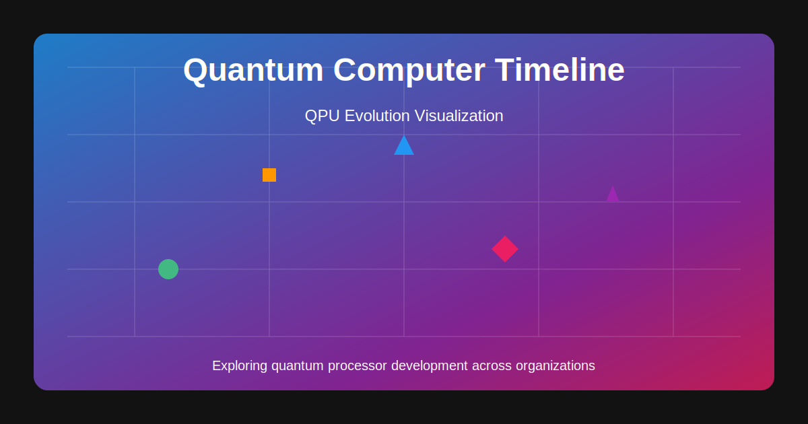

# Quantum Computer Timeline

An interactive visualization tool that tracks the evolution of quantum processing units (QPUs) over time. This application provides a visual timeline of quantum computers developed by various research organizations, with details on qubit count, release dates, and associated research papers.

## Features

- **Interactive Timeline Chart**: Visualize the progression of quantum computers with an intuitive scatter plot
- **Organization-based Color Coding**: Each research organization is represented with a unique color and symbol
- **Detailed Information**: Hover over data points to see detailed information about each QPU
- **Paper References**: Direct links to research papers and publications for each quantum computer
- **Responsive Design**: Works seamlessly on desktop and mobile devices
- **PWA Support**: Can be installed as a Progressive Web App with offline functionality
- **SEO Optimized**: Comprehensive meta tags, structured data, and search engine optimization
- **Performance Optimized**: Service worker caching, compression, and performance enhancements
- **Accessibility Features**: ARIA labels, semantic HTML, and keyboard navigation support

## Tech Stack

- **Vue 3**: Frontend framework with Composition API
- **Vite**: Fast, modern build tool
- **Tailwind CSS v4**: Utility-first CSS framework
- **ECharts**: Powerful charting library for data visualization
- **PapaParse**: CSV parsing library for data processing

## Data Structure

The application uses a CSV file (`public/data/qpu_timeline.csv`) with the following structure:

| Field | Description |
|-------|-------------|
| name | Name of the quantum computer |
| organization | Research institution or company that developed the QPU |
| type | Type of quantum computing technology (e.g., Superconducting, Trapped Ion, Photonic, etc.) |
| releaseDate | Date when the QPU was announced or published |
| qubitCount | Number of qubits in the quantum processor |
| externalLink | JSON array of research papers with title and URL |
| description | Brief description of the quantum computer's significance |

## Disclaimer

The quantum computing field is rapidly evolving, and despite our best efforts to maintain accurate information, some data in this visualization may become outdated or contain inaccuracies. Details about quantum processors, qubit counts, release dates, and organizational attributions are compiled from publicly available sources which themselves may contain varying degrees of precision or marketing claims.

**We welcome contributions to improve data accuracy:**

- If you find any errors or have more accurate/updated information, please submit an issue or pull request on GitHub
- For substantial additions or corrections to the dataset, please include references to verifiable sources
- Organizations working on quantum computing are encouraged to submit their own QPU data for inclusion

This project aims to provide an educational visualization of quantum computing progress rather than an authoritative technical reference. All information should be verified with original sources when used for research, academic, or business purposes.

## Contributing

We welcome contributions to improve both the application and the dataset. Please see the [CONTRIBUTING.md](CONTRIBUTING.md) file for detailed guidelines on:

- Data corrections and additions
- Bug reports and feature requests
- Code contributions
- Development setup
- Pull request process

## License

This project is licensed under the Apache 2.0 License - see the [LICENSE](LICENSE) file for details.

## Acknowledgements

- Data compiled from public research papers and announcements
- Built with Vue 3 and modern web technologies
- Visualization powered by Apache ECharts
- GitHub Copilot implemented most of the features
